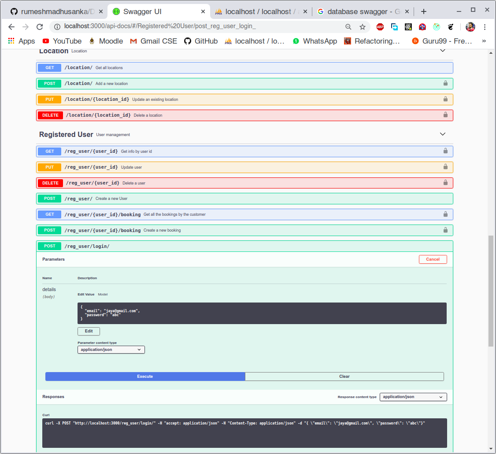
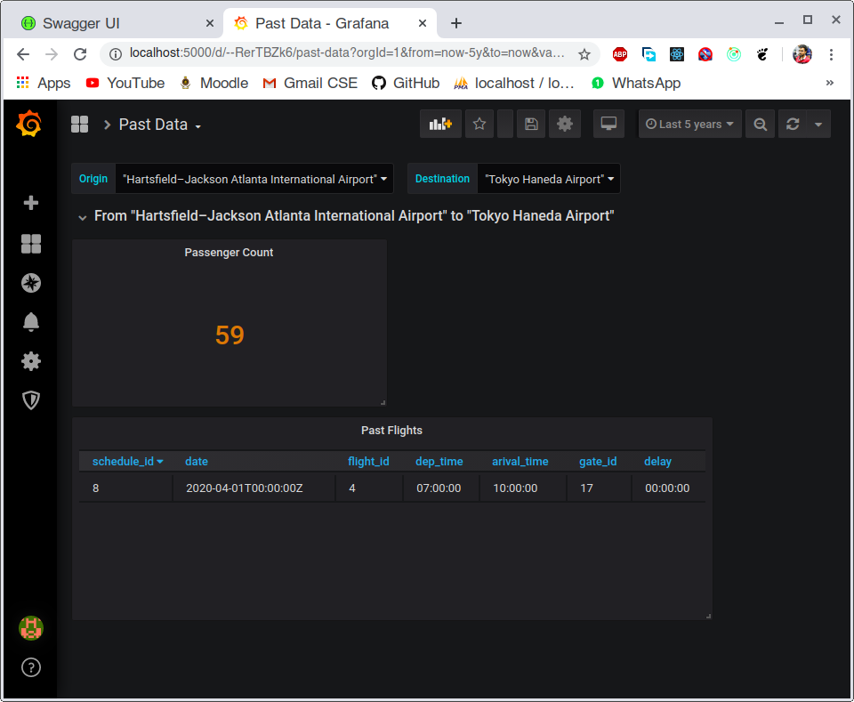

# Airline Reservation System REST API
 | 

## Features
* Triggers
* Functions
* Views
* Stored procedures
* Indexing 
* Using transactions where necessary


* Node Express REST api
* Using promises
* Documentation with `Swagger`(Open API 2.0)
* Centralized error handling
* Passwords hashed using `bcrypt`
* Authentication with jwt
* User input validation using `hapi/joi`
* Uses `promise-mysql` and connection pooling
* Load balancing using `pm2` process management
* Using `Docker`
* MIT license
* `Grafana` for Realtime Report generation 

## Prerequisites
- pm2 ```$ npm i pm2 -g```

- nodemon ```$ npm i nodemon -g```

## Install
```
$ npm install 
```

## Quick Start

- Import the sql file at **dbBackup** folder to your mysql server

- Add your database credentials to **db.conf.json**

- Run the project in dev mode with `nodemon`- ```npm run dev```

- Run the project- ```$ npm start```


## Authors

- [Rumesh Madhusanka](https://github.com/rumeshmadhusanka)

- [Kushan Chamindu](https://github.com/KushanChamindu)

- [Shashimal Senarath](https://github.com/shashimalcse)

- [Jayampathi Adhikari](https://github.com/jayampathiadhikari)